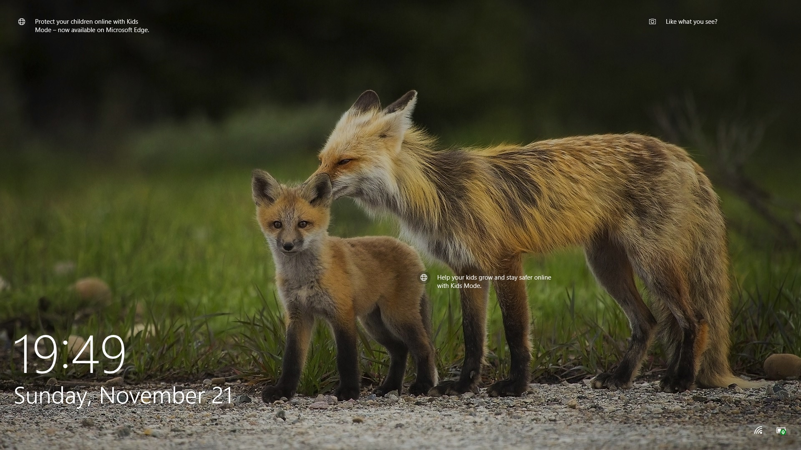

```{r setup, include=FALSE}
knitr::opts_chunk$set(echo = FALSE)
```

## Introducion

- Name: Jiaqi Chen
- Birthday: May 21st
- Where I grew up: Guangzhou, China
- What program I am in: PhD in Statistics
- When I expect to graduate: 2025

## A picture of my favorite animal

- My favrouite animal is fox.



## My favorite plot

```{r,echo=FALSE}
aseq <- seq(-4,4,.01)
plot(aseq,dnorm(aseq, 0, 1),type='l', xlab='x', ylab='Density', lwd=2)
lines(aseq,dnorm(aseq, 1, 1),col=2, lwd=2)
lines(aseq,dnorm(aseq,0, 2),col=3, lwd=2)
legend("topleft",c(expression(paste(mu==0, ", " ,  sigma==1 ,sep=' ')), 
             expression(paste(mu==1, ", " ,  sigma==1 ,sep=' ')), 
             expression(paste(mu==0, ", " ,  sigma==2 ,sep=' '))), 
       col=1:3, lty=c(1,1,1), lwd=c(2,2,2), cex=1, bty='n')
mtext(side=3,line=.5,'Normal distributions',cex=1, font=2)
```

## Link to the CV

https://github.com/stat850-unl/11-presentation-cj020/blob/master/CV850.pdf
